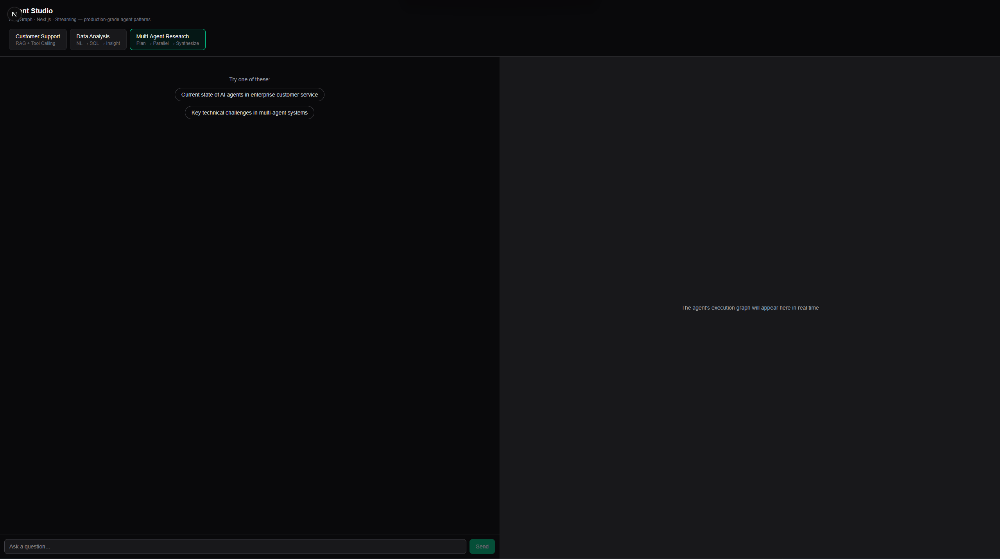

# Agent Studio

> A production-grade demo of **three AI agent patterns**, built with **LangGraph + Next.js**, featuring **live execution visualization**.

Most "AI agent" demos are a thin wrapper around a chat completion call. This one shows the part that actually matters in production: **turning opaque agent execution into observable, traceable, controllable state** — planning, tool calls, parallel execution, and streaming, all rendered live.



Three agent patterns, one clean architecture, one shared streaming protocol:

| Mode | Pattern | What it demonstrates |
|------|---------|----------------------|
| 🎧 **Customer Support** | RAG + Tool Calling (ReAct) | Knowledge retrieval + real-time tool invocation |
| 📊 **Data Analysis** | NL → SQL → Execute → Insight | Safe code generation with guardrails |
| 🔬 **Multi-Agent Research** | Plan → Parallel Research → Synthesize | LangGraph orchestration & parallel agents |

---

## Why this exists

The gap between "I called an LLM API" and "I shipped an agent product" is engineering:

- **Observable execution** — Every node start/end, tool call, and token is a structured event streamed to the UI. Users see *what the agent is doing*, not a spinner.
- **A single streaming protocol** — One SSE event contract ([`events.py`](server/app/events.py) ↔ [`types.ts`](web/lib/types.ts)) serves all three modes. The frontend renders any mode with one code path.
- **State as a first-class concern** — A Zustand-based state center ([`store.ts`](web/lib/store.ts)) reduces the raw event stream into two view models: conversation and execution graph. All event→state logic lives in one reducer.
- **Production guardrails** — The data agent only executes read-only `SELECT` on an in-memory DB; generated SQL is validated before it runs. Errors surface as structured events, never a hard 500.

---

## Architecture

```
┌──────────────────────────────────────────────┐
│  Next.js (App Router) — web/                   │
│  • Streaming chat UI                           │
│  • Live execution graph (React Flow)           │
│  • Zustand agent state center                  │
└───────────────────┬────────────────────────────┘
                    │  SSE (text/event-stream)
                    │  shared event protocol
┌───────────────────▼────────────────────────────┐
│  FastAPI + LangGraph — server/                  │
│  ┌────────────────────────────────────────────┐ │
│  │ support_agent   RAG + ReAct tool calling    │ │
│  │ data_agent      NL→SQL→execute→insight      │ │
│  │ research_agent  StateGraph multi-agent orch.│ │
│  └────────────────────────────────────────────┘ │
└──────────────────────────────────────────────────┘
```

**Layered, decoupled, extensible.** Adding a fourth agent mode means: write one handler, register it in the route table. No frontend change needed — the shared protocol handles it.

---

## Tech stack

**Frontend:** Next.js 16 (App Router) · React 19 · TypeScript · Zustand · React Flow · Tailwind CSS
**Backend:** Python 3.12 · FastAPI · LangGraph · LangChain
**Streaming:** Server-Sent Events with a custom structured event protocol

---

## Quick start

### 1. Backend

```bash
cd server
python -m venv .venv
source .venv/Scripts/activate      # Windows
# source .venv/bin/activate        # macOS/Linux
pip install -r requirements.txt

cp .env.example .env                # then add your OPENAI_API_KEY
uvicorn app.main:app --reload --port 8000
```

> Works with any OpenAI-compatible endpoint — set `OPENAI_BASE_URL` to point at your own gateway.

### 2. Frontend

```bash
cd web
pnpm install
cp .env.local.example .env.local
pnpm dev
```

Open [http://localhost:3000](http://localhost:3000).

---

## Project structure

```
agent-studio/
├── server/
│   └── app/
│       ├── main.py          # FastAPI entry, unified /api/chat streaming endpoint
│       ├── events.py        # Shared SSE event protocol (the core contract)
│       ├── llm.py           # Swappable LLM provider wrapper
│       └── modes/
│           ├── support_agent.py    # Mode 1: RAG + tool calling
│           ├── data_agent.py       # Mode 2: NL → SQL → insight
│           └── research_agent.py    # Mode 3: multi-agent orchestration
└── web/
    ├── app/page.tsx         # Single-page layout: chat + execution graph
    ├── components/
    │   ├── ChatPanel.tsx           # Conversation UI
    │   └── ExecutionGraph.tsx      # Live agent execution graph (React Flow)
    └── lib/
        ├── types.ts         # Event types mirrored from the backend
        ├── api.ts           # SSE streaming client
        └── store.ts         # Zustand state center (event → view-model reducer)
```

---

## Design notes

A few decisions worth calling out, because they're the difference between a toy and something production-shaped:

1. **Protocol-first.** The event schema was designed before either side was built. That's why one frontend renders three very different agent flows.
2. **Parallel execution is real.** The research agent runs its sub-tasks concurrently with `asyncio.gather` and streams results as each completes (`as_completed`) — the UI lights up multiple researcher nodes at once.
3. **Failure is a state, not a crash.** Every stream terminates with either a `final` or an `error` event, always followed by `done`. The UI never hangs.
4. **The mock layer is honest.** RAG uses keyword matching and the DB is in-memory SQLite — but every mock is commented with what it replaces in production (vector search, a real data warehouse). Nothing pretends to be more than it is.

---

## License

MIT
